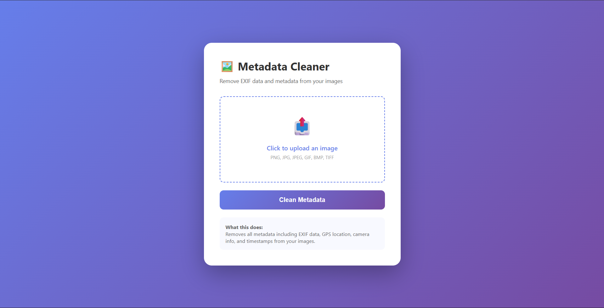

# 🔒 **Metadata Cleaner** – Your Privacy Protection Tool

A fast and secure web application that removes EXIF data and metadata from your images, protecting your privacy online — powered by **Python & Flask** with a sleek, modern interface.



[](https://metadatacleaner.vercel.app)
[](LICENSE)
[](https://www.python.org/)
[](https://flask.palletsprojects.com/)

## 🌟 Features

* 🖼️ **Smart Image Processing** – Remove metadata from multiple image formats
* 🔐 **Privacy First** – No data stored on servers, all processing in memory
* 🎨 **Beautiful UI** with gradient backgrounds and smooth animations
* 📱 **Fully Responsive** – Works perfectly on desktop, tablet, and mobile
* 🚀 **Lightning Fast** – Instant processing with serverless architecture
* 🔄 **Drag & Drop Support** – Easy file upload experience
* ✨ **Modern Design** with glassmorphism effects
* 🌐 **Zero Installation** – Access from any browser

## 📸 Preview

*Experience the clean and intuitive interface:*

- **Stunning purple gradient background** for a premium feel
- **Interactive upload area** with hover effects
- **Real-time feedback** with processing indicators
- **Smooth animations** for better user experience
- **Clean, professional design** that puts privacy first


## 🚀 Live Demo

Try it now: **[https://metadatacleaner.vercel.app](https://metadatacleaner.vercel.app)**

## 🔧 What Gets Removed?

When you clean an image with Metadata Cleaner, we strip away:

* 📍 **GPS Coordinates** – Location where photo was taken
* 📅 **Timestamps** – Date and time information
* 📷 **Camera Details** – Make, model, serial number
* ⚙️ **Camera Settings** – ISO, aperture, shutter speed, focal length
* 💻 **Software Info** – Editing applications used
* ©️ **Copyright Data** – Author and copyright information
* 🏷️ **Tags & Keywords** – Any embedded metadata tags

## 🛠️ Tech Stack

| Component | Technology |
|-----------|------------|
| **Backend** | Python 3.8+, Flask |
| **Image Processing** | Pillow (PIL) |
| **Frontend** | HTML5, CSS3, Vanilla JavaScript |
| **Deployment** | Vercel (Serverless) |
| **Architecture** | RESTful API with AJAX |

## 📋 Supported Formats

✅ **PNG** – Portable Network Graphics  
✅ **JPG/JPEG** – Joint Photographic Experts Group  
✅ **GIF** – Graphics Interchange Format  
✅ **BMP** – Bitmap Image File  
✅ **TIFF** – Tagged Image File Format  

## 🚀 Getting Started

### 🔧 Prerequisites

* Python 3.8 or higher
* pip package manager
* Git (for cloning)

### 📥 Installation

1. **Clone the repository**
   ```bash
   git clone https://github.com/KurianManuel/metadata-cleaner.git
   cd metadata-cleaner
   ```

2. **Create and activate a virtual environment** (optional but recommended)
   ```bash
   # Windows
   python -m venv venv
   venv\Scripts\activate
   
   # macOS/Linux
   python3 -m venv venv
   source venv/bin/activate
   ```

3. **Install dependencies**
   ```bash
   pip install -r requirements.txt
   ```

4. **Run the application**
   ```bash
   python api/index.py
   ```

5. **Open your browser and navigate to:**
   ```
   http://localhost:5000
   ```

## 📁 Project Structure

```
metadata-cleaner/
├── api/
│   └── index.py          # Flask application (backend)
├── templates/
│   └── index.html        # HTML structure
├── static/
│   ├── css/
│   │   └── style.css     # Custom styling
│   └── js/
│       └── script.js     # Interactive features
├── images/
│   └── metadatacleaner.png
├── vercel.json           # Deployment configuration
├── requirements.txt      # Python dependencies
├── .gitignore           # Git ignore rules
├── LICENSE              # MIT License
└── README.md            # Project documentation
```

## 🎯 How It Works

1. **User uploads an image** via click or drag-and-drop
2. **Image sent to Flask backend** using AJAX for smooth experience
3. **Pillow opens the image** and extracts only pixel data
4. **New image created** with just pixels (no metadata)
5. **Cleaned image returned** to user for download
6. **No storage** – Everything happens in memory and is immediately discarded

## 🌐 Deploy Your Own

### Deploy to Vercel (Recommended)

1. **Fork this repository**

2. **Sign up/Login to Vercel**
   - Visit [vercel.com](https://vercel.com)
   - Sign in with GitHub

3. **Import your repository**
   - Click "New Project"
   - Select your forked repository
   - Click "Deploy"

4. **Done!** Your app is now live 🎉

### Other Deployment Options

* **Railway** – One-click deploy
* **Render** – Free tier available
* **Heroku** – Classic PaaS platform
* **PythonAnywhere** – Python-specific hosting
* **Self-host** – Run on your own server

## 💡 Usage Examples

**Perfect for:**
- 📱 Sharing photos on social media without exposing location
- 🏠 Listing property photos online safely
- 💼 Professional portfolios without revealing camera gear
- 🎨 Artwork sharing without software information
- 🌍 Travel photos without GPS coordinates
- 📧 Email attachments with enhanced privacy

## 🔐 Privacy & Security

* ✅ **No file storage** – Images never saved to disk
* ✅ **In-memory processing** – Temporary processing only
* ✅ **No logging** – We don't track your uploads
* ✅ **Open source** – Verify the code yourself
* ✅ **No third-party services** – Your data stays between you and the server
* ✅ **4MB limit** – Prevents abuse and ensures fast processing

## 🤝 Contributing

Contributions are welcome and appreciated! Here's how you can help:

1. Fork the repository
2. Create your feature branch (`git checkout -b feature/AmazingFeature`)
3. Commit your changes (`git commit -m 'Add some AmazingFeature'`)
4. Push to the branch (`git push origin feature/AmazingFeature`)
5. Open a Pull Request

### 💡 Ideas for Contributions

- 📄 Add PDF metadata removal support
- 📦 Batch processing for multiple images
- 🔍 Before/after metadata viewer
- 🌙 Dark/light mode toggle
- 📊 Show removed metadata details
- 🎨 Custom branding options
- 🌍 Multi-language support
- 📹 Video metadata removal

## 🐛 Known Issues & Limitations

* **File Size**: Limited to 4MB on Vercel free tier
* **Animated GIFs**: Lose animation (become static images)
* **Processing Time**: 10-second timeout on free tier
* **Format Support**: Only image files (no PDFs or documents yet)

## 📝 License

This project is licensed under the MIT License - see the [LICENSE](LICENSE) file for details.

## 👤 Author

**Kurian Manuel**

- 🔗 [GitHub](https://github.com/KurianManuel)
- 💼 [LinkedIn](https://linkedin.com/in/kurian-manuel)
- 📧 [Email](kurianmanuel.2288@gmail.com)

## 🙏 Acknowledgments

- [Flask](https://flask.palletsprojects.com/) – Lightweight web framework
- [Pillow](https://python-pillow.org/) – Powerful image processing library
- [Vercel](https://vercel.com/) – Seamless deployment platform
- The open-source community for inspiration and support

## 📊 Stats


## 🌟 Show Your Support

If you found this project helpful, please consider:
- ⭐ **Starring** this repository
- 🍴 **Forking** it for your own use
- 📢 **Sharing** it with others who care about privacy
- 🐛 **Reporting** any issues you find
- 💡 **Suggesting** new features

## 📧 Contact & Support

Have questions or suggestions? Feel free to:
- 📬 Open an issue on GitHub
- 📧 Send an email
- 💬 Start a discussion in the Discussions tab

---

<div align="center">
  <strong>🔒 Made with ❤️ for privacy-conscious users everywhere 🔒</strong>
  <br>
  <sub>Protect your privacy, one image at a time!</sub>
  <br><br>
  <a href="https://metadatacleaner.vercel.app">Try it Now</a> • 
  <a href="https://github.com/KurianManuel/metadata-cleaner/issues">Report Bug</a> • 
  <a href="https://github.com/KurianManuel/metadata-cleaner/issues">Request Feature</a>
</div>
